# SO101 Robot Arm Course - Lessons 7 & 8: Slide Plan

## Overview

| **Target Audience** | Secondary 2-4 students (ages 14-16) |
|---------------------|-------------------------------------|
| **Lessons** | 7 (Morning) & 8 (Evening) |
| **Focus** | Motion recording, teleoperation, and ACT model training |

---

# 📚 Lesson 7: Introduction to Robot Control & Data Collection

## Slide Section 1: Setup & Assembly (15 mins)

### Materials Preparation
Each group (1-4) should have:
- ✅ Pre-assembled box with robotic arm mounted inside
- ✅ 2 screws
- ✅ Gripper camera module
- ✅ USB cable

### Connection Checklist
**Before connecting USB, connect DC power first:**
- 🔌 Black arm (Leader): **7.4V power supply**
- 🔌 White arm (Follower): **12V power supply**

### USB Hub Connections
Each group's USB hub should connect:
1. White robotic arm (Follower)
2. Black robotic arm (Leader)
3. Top-down observation camera
4. Gripper camera

> 💡 **Instructor Note:** Have assistants ready to help students with setup issues.

---

## Slide Section 2: Accessing the Control Interface (10 mins)

### Step 1: SSH into the Central Computer
Assign **one student per group** to:

```bash
ssh so101p2g[group_number]@[instructor_provided_ip]
```

*Instructor provides IP address and password*

### Step 2: Get the WebUI URL
```bash
webui-url
```

**Expected output:**
```
http://192.168.1.18:8021/?token=[random_string]
```

### Step 3: Open in Browser
- Copy the full URL
- Paste into a web browser
- Press Enter

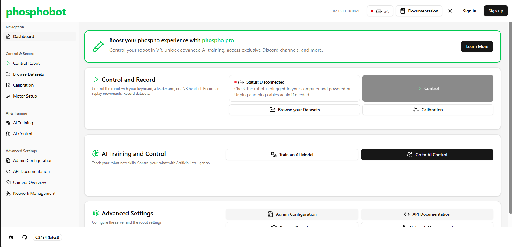

---

## Slide Section 3: Arm Configuration & First Control (15 mins)

### Verify Arm Connection
1. Look at the **top-right corner** of the interface
2. Confirm:
   - ✅ 2 icons showing **GREEN** (both arms connected)
   - ⚠️ Previously showed 1 icon **RED**

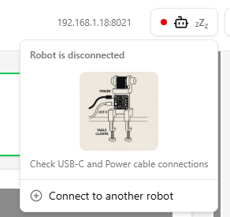

### Identify Leader Arm
1. Click **"Wiggle Gripper"**
2. Observe which arm moves
3. Click **"Assign as Leader"** for the **black arm**

### Navigate to Control Tab
Click on **"Control Robot"** tab

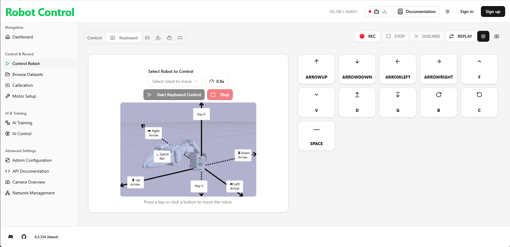

### Keyboard Control Setup
1. Under **"Select Robot to Control"**:
   - Choose the **white arm's ID** from dropdown
2. Click **"Start Keyboard Control"**

> ⚠️ **SAFETY WARNING:** First startup may cause sudden arm movement. Keep clear!

### Recording Your First Motion
1. Stop keyboard control
2. Click **"Create New Dataset"** button


3. Name it: `Group-[number]-first-dataset`
4. Leave **Task Instructions** blank
5. Click **Save**
6. Click **REC** button
7. Start keyboard control and move the arm randomly
8. Click **STOP** when finished
9. Click **Replay** to watch the motion

---

## Slide Section 4: Task 1 - Motion Recording Challenge (20 mins)

### Objective
Use the **motion recording method** to pick up an object.

### Requirements
- 📍 Object placed at a **fixed location**
- 👥 All group members must participate
- ✅ Demonstrate successful pick-up to instructor

### Challenge Extension
After picking up, place the object in a **specific container/location**.

---

## Slide Section 5: From Recording to AI (10 mins)

### Real-World Application
Motion recording is widely used in industrial robotics for:
- Repetitive manufacturing tasks
- Assembly line operations
- Quality assurance testing

### The Problem
> *"What if the object is in a different position every time?"*

Motion recording only works for **fixed positions**.

### The Solution: Action Chunking Transformer (ACT)

**What is ACT?**
- A machine learning model that learns from demonstrations
- Can adapt to varying object positions
- Uses **Transformer** architecture (same as ChatGPT!)

> 💡 **Student-Friendly Explanation:** Think of it like teaching the robot by showing examples, then it figures out how to do the task even when things change slightly.

---

## Slide Section 6: Teleoperation & Data Collection (30 mins)

### Setup Teleoperation
1. In **Control Robot** tab, click:

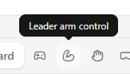

2. Configure arms:
   - **Leader arm ID**: Black arm (identified earlier)
   - **Follower arm ID**: White arm

3. Click **Start Control**
   - Moving the leader arm by hand → White arm follows

4. Click camera button to view camera feeds:

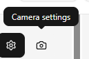

### Recording an ACT Dataset

#### Naming Convention
```
groupX-9May-pick-up-1
```
*(Replace X with your group number)*

#### Recording Best Practices

| Do ✅ | Don't ❌ |
|-------|----------|
| Always start from **init position** (all motors centered) | Start from random positions |
| Move **smoothly and continuously** | Stop abruptly or jerk |
| Be **consistent** (e.g., always open gripper first) | Change your approach mid-recording |
| **Pause 1 second** between actions | Rush through actions |
| Place objects at **varied positions** | Always use the same spot |
| Record **20+ episodes** for good training | Record only a few episodes |

#### Example Recording Sequence
```
Init Position → Aim at Object → [PAUSE 1s] → Approach Object → [PAUSE 1s] 
→ Adjust if needed → [PAUSE 1s] → Close Gripper → [PAUSE 1s] 
→ Lift Object → [PAUSE 1s] → Return to Init Position
```

> 💡 **Tip:** If you make a mistake, click **"Discard"** to retry the episode.

---

## Slide Section 7: Task 2 - Stack 3 Objects (20 mins)

### Objective
Use **teleoperation** to stack 3 objects.

### Team Coordination
- Each object should be placed by a **different groupmate**
- Work together to ensure smooth handoffs

---

## Slide Section 8: Task 3 - Complete Your Dataset (Homework/Lesson 8)

### Requirements
- ✅ Record at least **20 episodes**
- ✅ Verify upload on [Hugging Face](https://huggingface.co/parami-dev1)
- ✅ Dataset name: `groupX-9May-pick-up-1`

### Optional: Start Training
If time permits, begin Lesson 8 training steps.

---

---

# 📚 Lesson 8: AI Model Training & Inference

## Slide Section 1: Navigate to AI Training (5 mins)

1. Return to the WebUI
2. Click **"AI Training"** tab

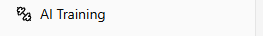

---

## Slide Section 2: Account Setup (10 mins)

### Create Phosphobot Account
1. Click **"Create Account"**
2. Use your **own email address**
3. Check your email inbox for verification link
4. Click the link to verify
5. Return to WebUI → **AI Training** tab (may need to refresh)

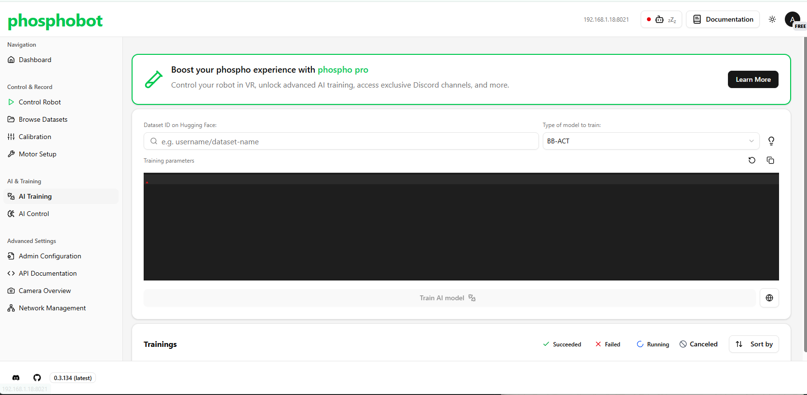

---

## Slide Section 3: Configure Training (15 mins)

### Step 1: Select Dataset
Enter your Hugging Face dataset repository:
```
parami-dev1/groupX-9May-pick-up-1
```

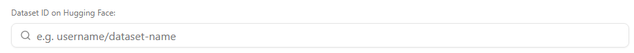

### Step 2: Choose Model Type
Select **ACT** (Action Chunking Transformer)

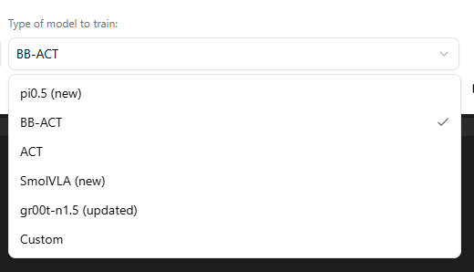

### Step 3: Training Parameters

**Use these settings:**
```json
{
  "batch_size": 8,
  "steps": 8000,
  "save_freq": 5000
}
```

> ⚠️ **Important:** `batch_size` must not exceed 8!

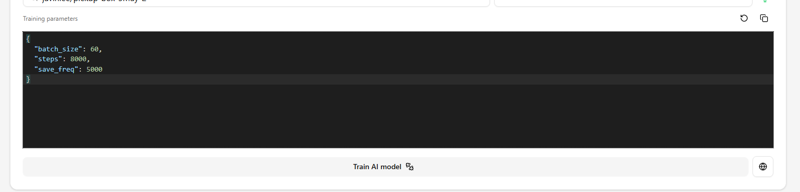

### Step 4: Start Training
Click **"Train AI Model"**


---

## Slide Section 4: Monitor Training with MLflow (20 mins)

### Access MLflow Dashboard
Instructor will provide the MLflow URL.

### Find Your Experiment
1. Look for experiment named after **your group**
2. Click to view training runs

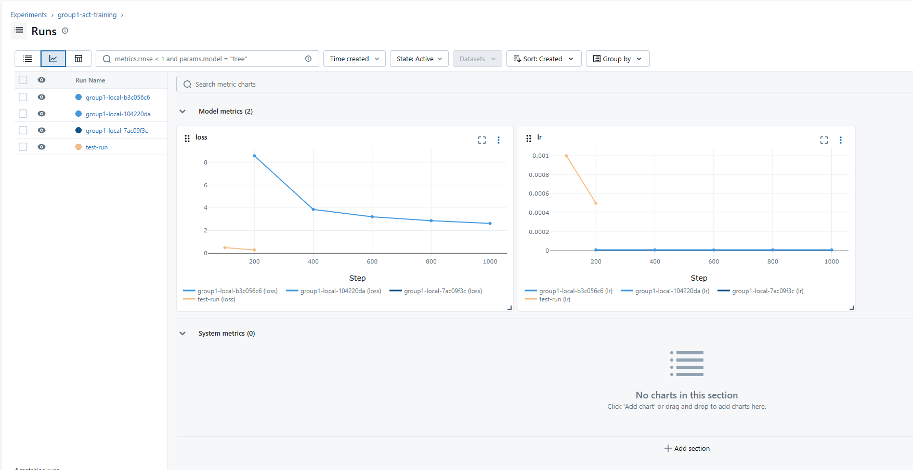

### Understanding the Loss Curve

| Observation | Interpretation |
|-------------|----------------|
| **Downward trend** | Model is learning ✅ |
| **Negative exponential curve** | Healthy training ✅ |
| **Flat line** | Model not learning ❌ |
| **Spikes upward** | Possible overfitting ⚠️ |

> 💡 **Concept:** Loss measures prediction error. Lower loss = better model performance.

---

## Slide Section 5: Inference - Test Your Model (20 mins)

### When Training Completes
1. Navigate to the **Inference** section
2. Select your trained model
3. Follow instructor's steps to test

### What to Expect
- Model should pick up objects at **varied positions**
- Compare performance vs. motion recording

---

## Slide Section 6: Wrap-up & Reflection (10 mins)

### Discussion Questions
1. How did ACT differ from motion recording?
2. What would improve the model's performance?
3. Real-world applications of learning-based robotics?

### Key Takeaways
- ✅ Learned teleoperation for data collection
- ✅ Understood how AI models learn from demonstrations
- ✅ Experienced the full ML pipeline: data → training → inference

---

# 📎 Appendix

### Quick Reference: Dataset Naming
```
groupX-9May-pick-up-1
```

### Quick Reference: SSH Command
```bash
ssh so101p2g[group_number]@[ip]
webui-url
```

### Troubleshooting
| Issue | Solution |
|-------|----------|
| Arms not detected | Check USB connections and power |
| Cannot SSH | Verify IP address and password with instructor |
| WebUI won't load | Try different browser or refresh |
| Training won't start | Verify dataset is uploaded to Hugging Face |

### Resources
- Hugging Face: https://huggingface.co/parami-dev1
- MLflow Dashboard: *[Instructor provides]*
